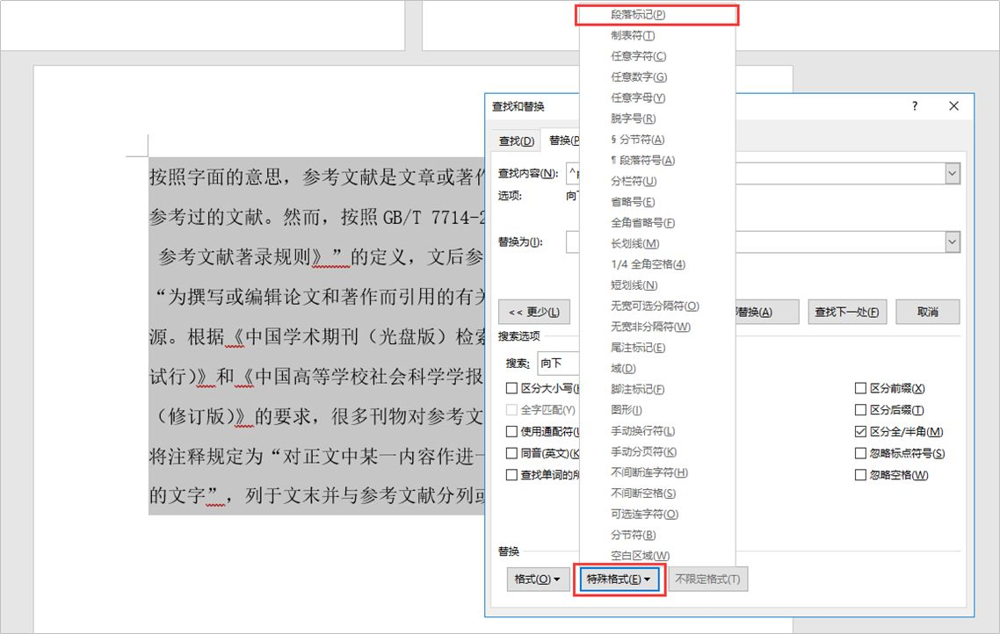

# 工具使用及技巧

## 论文格式

撰写论文处理上述内容之外， 论文的格式和排版也很重要 ， 格式不规范或者没按要求可能会被导师怼的很惨！格式和排版这一块每个学校得要求都不尽相同 ， 撰写论文之前最好拿到学校的论文排版和格式要求说明仔细阅读 ！ 下面介绍一些撰写文档时的小技巧 ，希望大家可以在论文排版上不走弯路 ， 大大提升效率，顺利毕业！

### 1. 封面页下划线自动对齐

论文封面的排版对其一直都是撰写论文时的痛点 ， 姓名、学号、学院、指导老师等等信息的长度都是不同的，拼命敲空格对齐 ， 却死命都对不齐，就像下面这种排版，不是长了就是短了

其实很简单，只需要插入一个2列6行的表格，让表格居中：

然后将字段右对齐，详细信息居中对齐，留下第2列的下边框，就能实现封面页下划线自动对齐了：

绘制下划线的办法也很简单，全选「**表格**」，点击「**设计**」选项卡的「**无边框**」，在依次选中每一个单元格，选择「**下边框**」即可。

### 2. 一键删除换行

Ctrl+C/V作为写毕业论文最强大的技巧，虽然好用，但是难免会碰上从PDF/网页上复制过来的文字，要么文字/符号出现错误，要么出现了很多换行符，就像这样：

如果是出现了换行符，那么处理的技巧非常简单，选中复制的内容，按「**Ctrl+H**」进行替换，找到「**特殊格式**」-「**段落标记**」，替换内容什么都不写，点击「**全部替换**」就可以一键删除「**换行符**」了。

在PDF上，百度文库上复制别人的文档就会碰到这种情况，使用这招就可以轻松搞定。

### 3. 设置自动保存/自动备份

写的论文再好，排版在精美，如果忘记保存了这个时候电脑又出故障或者端点了，那么就是一场悲剧，非常多的小伙伴甚至写了一个上午的论文都不会按一下「**Ctrl+S**」进行保存。

或者按了「**Ctrl+S**」，文件闪退后直接损坏了，如果没有备份那么损失就惨重了。这个时候就需要设置下**自动保存/自动备份**。

步骤很简单，在「**文件**」选项卡下点击「**选项**」，如下：

在「**Word选项**」窗口中找到「**保存标签**」，设置「**自动恢复信息时间间隔**」为 3 分钟，同时这里还有一个恢复的位置需要记忆下，如果文件损坏可以去这里寻找。

### 4. 特殊字符的输入

在论文的编辑过程中，难免会输入「**版权所有**」「**注册**」「**商标**」等特殊字符，这些字符在哪里寻找呢？很简单，点击「**插入**」选项卡下的「**符号**」-「**其他符号**」。

在「**特殊符号**」下就能找到这些符号了，并且一些常用的符号还设置了相应的快捷键。

### 5. 批量修改文字样式

绝大部分毕业论文的中英文字体都是固定的，例如中文是「**宋体**」英文是「**Times New Roman**」，如果在边写的时候一遍反复切换字体，可能会变得非常混乱。

其实，在Word中，你可以一键修改，选中所有的文字，在「**开始**」选项卡下点击「**字体**」，将中文字体设置成宋体，西文字体设置成Times New Roman即可一键修改。

### 6. 文献/图表的交叉引用

文献引用作为论文中非常重要的一部分，在绝大部分毕业论文/学术论文中都会大量引用。如果在论文中大量引用了文献，你是不是还在手动一个一个标记上序号呢？

其实有更简单的办法，在「**开始**」下的「**段落**」-「**编号**」，就可以重新设置符合论文规范的编号格式，这样就可以一键设置了。

那么设置完的编号，如何在论文中进行引用了，也超级简单，鼠标点击插入引用的位置，选择「**引用**」-「**交叉引用**」，轻松搞定。

### 7. 论文导航目录一键抵达

写了几十页的论文，每次切换到固定的位置要不就只能在目录页按Ctrl键进行切换，要不就只能使用鼠标滚轮慢慢滑，其实Word提供了一个「**导航窗格**」的小功能。

勾选「**视图**」选项卡下的「**导航**」，在左边就可以看到导航了。

想跳转到哪里，直接鼠标点击一键跳转即可，超级方便，甚至你还可以在导航窗格中调整整篇文档的结构等等。

### 8. 两份文档并排查看

如果想对比两份文档同个位置的差异，使用Tab来切换不仅麻烦而且还需要使用鼠标滚轮滚动位置，这个时候就需要开启Word的并排查看功能了。

勾选「**视图**」选项卡下的「**窗口**」中的「**并排查看**」，打开的两份文档就会并排在同个窗口中。

注意下，如果只打开了一份文档，这个功能其实没什么用的，这个时候你鼠标滚动的时候注意下，如果只打开了一份文档，这个功能其实没什么用的，这个时候你鼠标滚动的时候

### 9. 设置页面布局&装订线

毕业论文在一般情况下使用的是A4纸，并且上下左右边距为2厘米，装订线1厘米，设置也很简单。

点击「**布局**」选项卡下的「**页面设置**」选择A4纸。

然后点击「**页面设置**」下的「**页边距**」，设置边距2厘米，装订线左侧1厘米。

记得「**装订线位置**」需要选择「**靠左**」，绝大部分毕业论文装订都是靠左的，当然也有例外。

### 10. 论文一键生成目录

在Word中，如果你为不同的段落设置了不同的「**大纲级别**」，在哪里设置呢？选中某个段落，点击「**开始**」选项卡下的「**段落**」，在常规中就可以找到大纲级别。

为不同的段落分别设置**正文、1级、2级、3级等等大纲**级别。

这个时候就可以在Word中一键插入目录了，操作的技巧也非常简单，点击「**引用**」选项卡下的「**手动/自动目录**」就可以搞定。

如果有新的大纲，还可以点击「**更新目录**」进行更新，再也不用一个一个插入目录了。并且利用大纲生成的目录还支持按住Ctrl键鼠标点击跳转到指定的位置，非常强大。

### 11. 在论文中插入页码/分节

在Word中插入页码非常简单，但是如果要从正文中插入页码，就有很多同学不熟悉了，那么如何从正文才开始插入页码呢？

首先我们需要点击「**开始**」选项卡下的「**显示标记**」按钮，如下：

这里主要用到「**分节符**」，主要作用是插入分节符后，下一页就会自动另起一页变成新的一部分，这个时候，插入页码就可以使用新的页码了。

在页码起始页的上一页结尾插入「**分节符**」后，鼠标点击页码起始页，打开页码设置，勾选「**起始页码**」设置为1，这样就可以从正文处开始插入页码了。

默认仍然是勾选「**续前节**」的话，页码仍然是延续上一节的，这里需要注意下。

### 12. 英文字符换行问题

在Word中，如果中英文在统一段落中，并且由于英文单词被划分的不一致，经常会出现英文换行，导致前面的文字间距变大或者留空的情况，如下：

这个时候是因为Word将英文识别为一体，将它换行完整显示出来了，只需要打开「**段落设置**」，勾选「**允许西文在单词中间换行**」，这样Word就不会将它识别成一个整体，可以换行了。

现在就变成这样子了，排版更加自然：

## PPT格式

PPT这里没有什么特殊的格式要求 ， 自由发挥去做就好 ， 注意 ： 简洁美观大方， 不要搞一些花里胡哨的特效 ！建议从各大素材库找一些答辩PPT的模板素材 ， 如果学校有提供PPT模板就是用学校提供的PPT模板 ， 大家可以从以下平台找到PPT模板素材 ： 

百度文库 ： https://wenku.baidu.com/

千图网 ： https://www.58pic.com/

匠心派 ： http://888.yagsan.cn/

大家网上搜索“PPT模板”可以搜索到很多

## 绘图工具

撰写毕业论文过程中经常会用到一些图形去辅助描述一些流程和原理以及结构 ， 简单的绘图使用Word就可以完成 ， 但是如果Word使用不熟悉的话， 绘图效率会很低下 ， 下面给大家推荐一些比较好用的绘图工具 ： 

visio studio ： office套件之一 ， 非常好用的绘图软件

draw.io ：非常好用的一款在线绘图工具 ， 当然也可以下载客户端使用体验会更好一些

Excel :  office套件之一 ，如果需要一些图表（饼图 折线图 柱状图等）可以使用Excel绘制好复制到论文中

