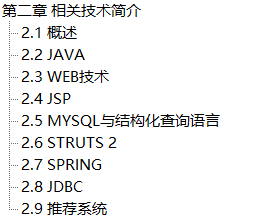
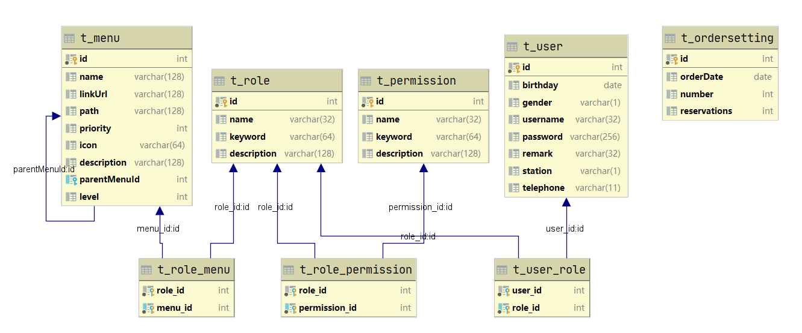

## 目标
主要分为三个部分：**开题**, **正文**, **答辩**。

**开题：**主要指开题报告, 目的是为接下来的毕设确定方向 , 向导师说明我们的项目方向与意义, 并且写出开题报告。这个的重要点在于要给导师讲我们即将要向什么方向出发。

**正文：**主要指的是论文的主体部分, 是我们研究内容的详细铺展介绍。有文字字数, 格式等方面的限制。一般大专院校要求的字数比较少, 本科院校要求的字数比较多, 但都对格式有严格的要求。这部分主要是内容+排版组成。

**答辩：**主要是指我们展示研究成果部分, 是对我们研究的总结。这个重点在于要给导师讲我们的成果。

开题与答辩都是要导师进行参数并审核的, 所以这两块就是即将要毕业的学生关注重点。正文重点在于格式, 图文并茂。

## 高校毕设流程

各个学校的毕业设计的流程可能不太一样, 但是大同小异 , 一般来说流程如下 : 


**1. 选题 :** 选题是毕业设计的第一个部分 , 也往往是大家比较容易忽视的一部分 , 选题决定着论文的上下限以及最终完成的成果 ! 一篇优秀的毕业论文往往就是从选题开始精心策划的

**2. 开题 : **选题完毕之后一般会有一定的时间进行资料的收集以及学习 , 之后就会进行开题答辩 . 开题答辩主要是为了验证你是不是真的知道自己的课题需要做什么以及要论证具体执行方案的重难点及可行性

**3. 论文撰写 : **顾名思义, 这一阶段我们就需要进行论文正文的撰写了 

**4. 检查评阅 : **论文初稿撰写完毕之后, 需要对论文的格式内容以及重复率做一些检查

**5. 答辩 : **结题答辩是为了展示你的所有研究成果和工作内容 , 在答辩的过程中一定要做到对自己论文中所写的全部内容有一定的了解并且能够解释大部分与论文重难点相关的问题

**6. 总结 : **最后就是对自己的学习生涯的总结以及对未来的展望了

## 论文撰写工具

撰写论文的过程中经常查阅一些资料 , 画一些图形图表 , 以及论文格式的检查 , 使用工具可以提高论文的撰写效率 , 下面是一些常用的论文写作工具

### 文献资料查阅

撰写论文过程中收集查阅文件资料 , 可以到 **百度学术** , **中国知网** , **谷歌学术**等品台上根据关键词搜索相关文献 


### 论文撰写工具

**Word : ** Word就不用过多去说了 , 可以使用Word来进行论文的撰写以及对论文的格式进行调整

**Excel :** 可以使用excel将一些数据表格化插到论文中

**Visio Studio : ** 微软旗下的产品, 与Word的兼容性好 , 可以使用它来画一些框图和流程图时序图等

**亿图图示 : **和visio类似, 亿图图示也可用于画框图, 功能很强大 , 软件自带很多模板, 样式很精美

**思维导图 : **使用思维导图可以梳理思路 , 把握论文撰写的脉络 , 常用的思维导图软件有很多, 例如 : xmind


# 第一步: 快速搞定开题报告

开题报告指的目的是为了找出研究空白，进而在开展自己的研究项目，所以开题报告，是在他人的研究基础上提出自己的研究假设和研究方向。

好的开题报告应该包含以下 7个部分 : 

1. 课题背景及意义
2. 文件综述
3. 研究内容
4. 论文组织结构
5. 进度安排
6. 预期目标


## 1.1 如何选题

### 1.1.1 选题方向

撰写论文的开题报告首先要有选题。选题就是论文的研究题目。选题有几种来源, 要么来自于个人的生活经验或专业经验, 要么来自文献阅读, 要么来自于老师的建议。

选题需要注意的有四点 :  具有现实意义，具体的项目，能做出来，不要太新也不要太旧。


### 1.1.2 选题背景和意义

选题背景可以理解为研究目的 , 选择了一项研究到底要达到什么目的, 这是研究者首先需要明确的目标 , 通常选题意义或研究目的可从以下几个方面来看 : 

1. 现实意义

2. 理论价值

3. 实践价值

4. 个体目的

5. 知识发展

任何一项选题都可能从以上几个方面来设定其意义, 但并不是每一个选题都要达到这些目的, 这要视选题大小、范围和类型而定。

**示例一 :** 

论文题目 :  《JAVA电子商城系统架构与实现》

选题背景 : 

```
随着互联网的不断发展，网络已经成为人们进行信息传递的主要通讯工具，同时，一种全新的贸易活动正在形成，即通过互联网进行各种商贸交易。传统的定点定位的销售方式已经逐渐被电子商城这种实时在线的销售方式所取代，而且电子商场以及网络消费也逐渐被大众所接受。随着我国信息化建设的不断推进,企业传统的销售方式必须要加以改变,要顺应时代潮流,电子商城营销平台的发展势在必行。本文的课题正是基于这点提出来的。 电子商城就是以互联网为基础来构建的大型在线商品交易平台，其主要作用就是通过电子商务平台向客户准确、实时的销售产品。目前电子商城正在朝规模化、多样化、企业化演变，未来的电子商城将会成为产品销售中不可替代的重要手段
```

上述示例就从 现实意义 的角度去论述了选题的背景

**示例二 :** 

论文题目 :《LAMP下的员工满意度调查系统的设计与实现》

选题意义 :

```
对于研宄整个系统，包括从需求分析、软件选型、模块制定、软件测试验收等一系列过程，也代表了此过程可以应用到不同需求的系统幵发实施。研究此发过程也可以作为其他类似项目指导。无论从管理方面，还是从技术开发方面都具有参考意义
```

上述示例从 现实意义 以及 实践价值 和 知识发展 的角度去论述了选题的意义

**示例三 : **

论文题目 :《积分商城的设计与实现》

选题意义 :

```
中国互联网快速发展的年，从最早的互联网邮箱、互联网门户网到后来的网络游戏、财经网站，再到团购网站，互联网的更新换代速度很快，在这之中电子商务是当今互联网发展的稳定热点。正如淘宝网（含天猫）2012年双活动营业额170亿，到了2013年“双活动营业额高达350亿，可以预见，电子商务的未来是无可限量的。当前现有的电子商务的网站大多是消费者的需求式购物，即当用户有所需求才上网购物。怎样培养用户的消费习惯，促使用户产生被动消费，一直以来都是电子商务想要解决的一大难题，本论文从解决这一难题的目的出发，提出一种新的购物模式：制造一系列和用户的交互，用户通过做一些简单的点击任务来赢取积分，用户可以通过自己积累的积分来兑换对应的商品，以此刺激消费者在被动中接受积分，从而促进消费。
```

上述示例从 理论价值 角度去论述了选题的意义


### 1.1.3 文件综述

文件综述就是论述一些国内外的研究现状 , 也就是说别人是怎么来做这一块的研究的 ! 

这一部分一定要是用自己的话去表达和总结的 , 接下来要对这些研究成果进行一个简单的评述来引出自己的研究目标和方法

**示例一 :** 

论文题目 : 《基于J2EE技术的电商支付管理模块设计与实现》

研究现状与目标 : 

```
	电子商务是基于 B/S，即 Browser/Server（浏览器/服务器）应用方式的一种新型商务运营模式，在因特网开放的网络环境下，全球各地广泛的商业贸易活动均可以通过电子商务系统实现而不需要买卖双方见面进行交易。在电子商务系统中，消费者可以网上购物、商户之间可以进行网上交易和在线电子支付以及各种商务活动、交易活动、金融活动和相关的综合服务活动
	电子商务的主体是商家(Business)和消费者(Consumer)，他们之间进行交易及联系的平台为网上商城，认证中心(CA)则主要负责交易的安全认证及监管，银行、金融机构负责资金流通。 按照电子商务的实质内容来划分，电子商务可分为五种模型：商户与商户之间的电子商务模式(B2B)；商户与客户的电子商务模型(B2C)；客户与客户之间的电子商务模式(C2C)；商户与其员工之间的电子商务(B2E)；商户与政府之间的电子商务模式(B2G)。 
	网络时代电子商务的蓬勃发展，使得货币支付手段与方式也发生了创新性的变革。在电子商务中最为关键的要素就是网上银行所提供的电子支付服务，只有有了网上银行服务，才能实现真正的网上购物，否则电子商务就会由于不能在线付款而无法顺利完成。支付手段与方式变革的典型表现即为电子支付方式的出现。 
   现阶段我国网上交易的发展水平同欧美等发达国家相比仍存在很大的差距。虽然我国的电信网络基础设施在最近十年中有了长足的发展，但我国毕竟还是发展中国家，就信息网络基础设施、社会法律及诚信环境建设等方面还处于起步阶段。因此就整体而言，我国网上交易的发展仍处于初级阶段，在交易手段、范围、交易人数、安全认证等技术方面仍处于初级探索阶段。其中制约电子商务发展的一个最根本的方面就是电子支付技术，电子支付技术是电子商务中的核心技术，是指电子交易的当事人使用安全的电子支付手段通过 internet 进行货币支付或资金流转的过程。由此可见，构建一个安全、可靠、便捷的电子支付管理模块对整个电子商务系统具有极其重要的意义。 
	本文的研究目标是重点研究如何使用 SpringMVC+ibatis+freemarker 技术实现电子商务系统中支付方式及支付机构的管理、设置前台用户的支付界面的显示、前台用户支付与第三方支付机构的通信、支付单的管理等功能
```

**示例二 :** 

论文题目 : 《网上商城的进销存管理系统》

研究现状与目标 : 

```
	随着全球经济的飞速发展，物流业的全球普及和运输速度的提升，以及人们在日常生活中对于互联网的依赖等原因，在全球范围内对企业管理系统的需求不断增大，并且由于 Internet 技术的发展，对于企业管理系统编写的技术也日渐成熟。相对国内来讲，在中大型企业的应用方面要领先与其他企业。近年来我国企业意识到了利用科学的信息化技术来管理企业所带来的好处，国内企业也逐步开始了对企业管理系统的使用，使信息化管理系统具有巨大的生命力和社会前景。 

	进销存管理系统是在信息平台的基础上发展而来的一个企业管理系统，主要用于智能化的企业管理。可以极大程度的减少人工可能会带来的各种失误，实现对电子商务整个业务流程的自动化管理。由于信息化技术被越来越多的人接受和认可，人们对于信息技术的不断认可和学习，企业的不断进步，使得用户的需求变得更为符合自己的意愿和更合乎逻辑。 
	就目前的情况来看，我国进销存管理系统的层次分布十分清晰： 
	在大型企业对系统进行整体的部署、架构，确保系统安全稳定的运行，然后是按照用户的需求对数据的深入挖掘和不断加工，对各个功能模块的集成、整合，使得整个系统能够功能完整，安全无误的运行。 
	而相对大型企业、中型企业会采用更为节约资金的方法，收缩业务，使得业务的模块更为集中具体[2]，进销存系统使得整个企业由各个分散的店面管理逐渐转为连锁、统一结算的方式。 
	而在小型企业，由于资金等多方面因素，没有很好的采用信息化模式进行对企业的管理，还只是停留在初级阶段，流于表象，对于整个企业管理系统的建立还处于摸索阶段，存在着较大的上升空间。 
	综上而言，对于各种不同的企业而言有着较大的差异，但我们可以发现所有的企业都在向着企业信息化的道路上不断前进，都认识到了信息化的重要性，同时也在尽自己最大的努力对于企业的信息化进行不断的努力。

	本系统是针对网上商城自身的特点，对整个业务流程进行分析，并非针对于某一个企业而言，有较好的普遍性和实用性。 
```


**示例三 :**

 以上示例都是引用别人的论文, 如果需要基于一个现有项目快速完成自己的毕设 , 自己去撰写文件综述也是必不可少的 , 例如我们以**传智播客·黑马程序员**项目库中**《传智健康》**项目为例， 该如何去编写文件综述呢 ？ 如下所示 ： 

论文题目 : 《基于JAVAEE的健康管理系统设计与实现》

研究现状与目标 : 

```
	“健康中国”上升为国家战略，成为十三五重点规划。而预防胜于治疗，也是医疗行业中的共识。在国家的大力推广下，以及人们对健康的重视程度逐步提高的今天，健康管理机构如雨后春笋般，由2008年的300家迅速增长到2017年的7000家。这些健康管理机构又迫切的需要大量高质量信息化系统的支持。中国大健康产业整体规模是8万亿，参照美国大健康产业的市场细分，健康管理市场规模达8800亿。健康管理机构的信息化投入约占28%，即2500亿左右。
	健康数据现在越发变的重要，数据是形成健康档案的基础，是平台进行个性推荐的分析原料，健康数据包含用户的体检报告数据、健康评测数据、运动数据、饮食数据、体征数据；现阶段对平台来讲较为真实有效的数据为体检报告数据和体征数据，体检报告数据最为重要也最为真实可靠，但是需要平台与医院体检系统的深度对接才能获得，另外用户自行通过健康设备（血压、血糖、尿常规等）上传的体征数据相对也比较可靠，平台不能只是单纯的展示这些数据，这样对用户来讲毫无吸引力，多数平台会对这些数据或多活动地进行些统计分析，其中分析的维度包含有历次数据的对比趋势、平均值、极值、疾病风险、健康建议等；
	随着国家对医疗健康政策的调整，越来越多的新兴健康管理机构涌现，大批的创业者和传统医疗公司纷纷加入，健康管理机构的业务不能快速的成型，投入产出不成比例等问题逐渐浮现。而传智健康管理系统应运而生，能够充分解决这些问题。
```

以上数据以及内容是需要大家去网上搜索一些相关的新闻和文章 , 阅读一些文献 , 想写好一篇论文还是需要花费一些时间课精力的


### 1.1.4 研究内容

研究内容这一部分主要要阐述要做什么 , 首先要简要说明你打算开展哪些研究  , 这一部分的描述一定要有一定的逻辑性和层次感 , 内容的要点要列出来 ! 

**示例一 :** 

论文题目 : 《基于J2EE的学生网络调查系统设计与实现》

研究内容 :

```
本课题旨在建立一个基于 J2EE 的 WEB 应用系统，提供问卷创建，问卷编辑，问卷发布，问卷统计，题目添加删除修改，友情链接管理等功能；题目支持单选题、多选题、带文本输入的单选题、带文本输入的多选题、问答题；用户可以给某问卷添加图片；用户可以给问卷设置密码，IP 限制，包括黑名单和白名单，用户也可以设置同一 IP 是否可以重复提交等防止一人多卷的选项；系统提供对客观题调查结果的智能统计，并用图表展示出来；针对每一张问卷的每一个题目的任意选项，用户也可以设置截断，终止调查，也可以设置跳转，即被调查者点击了某个选项后自动跳转到与该选项匹配的后续题目上，以实现采集不同的网络调查的用户答卷情况信息。 
```


**示例二 : **

论文题目 : 《基于J2EE技术的电商支付管理模块设计与实现》

研究内容 :

```
	根据以上所述网上商城系统的内部逻辑复杂安全性要求苛刻网上交易的信誉评级需要改进传统的企业开发平台面临着严峻的挑战为了适应各种需求J2EE作为SUN公司的一种利用JAVA2平台简化的企业解决方案成为最好的选择在开发、部署和管理相关复杂问题的体系结构中可以搭建可伸缩性、灵活、易维护的电子商务平台。
	本文将从不同的JAVA企业应用体系中进行论述和比较从层次、应用组件、结构、核心技术以及结合当前网络形态对JAVAEE平台进行分析并深入探讨平台中的核心技术EJB。以本地某大型批发市场网上商城项目为背景对该项目在JAVAEE架构下进行系统的分析和设计
```


**示例三 : **

论文题目 : 《基于JAVAEE的健康管理系统设计与实现》

研究内容 :

```
本系统是一款应用于健康管理机构的业务系统，实现健康管理机构工作内容可视化、患者管理专业化、健康评估数字化、健康干预流程化、知识库集成化，从而提高健康管理师的工作效率，加强与患者间的互动，增强管理者对健康管理机构运营情况的了解。
包括管理后台、微信公众号、预约系统、评估系统、干预系统、知识库系统等子系统 , 功能包括档案管理、预约管理、健康评估、干预方案、知识库维护、用户推荐、系统管理、连锁化经营、智能硬件外接、统计分析等相关功能
```


### 1.1.5 组织结构

论文组织结构顾名思义就是阐述自己论文的各个组成部分 , 以及每个部分的概述内容

**示例一 : **

论文题目 : 《基于J2EE技术的网上商城系统设计》

论文组织结构 : 

```
主要研究内容及章节分配如下 :
	第一章为绪论介绍了国内外电子商务商城的发展状况和相关研究的背景
	第二章阐述基于的网上商城系统开发的基本理论和方法讨论的层次、组件、结构、优势以及核心技术
	第三章网络安全开发技术与电子支付模型。
	第四章建立网上商城卖家评价体系。前期要解决的技术模型的开发比较分析现有商城系统的支付模型对信用评级体系进行合理的设计
	第五针对实际案例进行系统的分析和规划进行功能的划分
	第六章网上商城系统的实现汇集了商城中应用的关键技术及代码
	第七章系统测试
```


**示例二 : **

论文题目 : 《积分商城的设计与实现》

研究方案及技术路线 : 

```
本论文主要研究内容及章节分配如下 :
	第一章是绪论，介绍了论文的研究背景，国内外研究现状，以及论文结构。
	第二章对本积分商城网站相关的技术进行简要介绍，主要包括技术、技术、技术中的模版技术和技术、框架、框架、编程模式和数据库技术。
	第三章对系统进行需求分析，包括市场分析、可行性分析、功能分析、扩展分析和行为分析。全面的为网站的提出需求分析，为之后的设计和实现打下基础。
	第四章根据需求分析进行网站设计，包括前端交互和页面设计、后台控制层设计、数据库设计和配置设计（包括持久层、和软硬件配置），
	第五章根据第四章的设计对网站的实现分三个方面来阐述，整体实现、模块实现和关键功能点实现。
	第六章对网站的实现进行了页面测试和功能性测试，并根据测试结果进行相关分析。
	第七章对本论文提出总结和展望。
```


其实都很类似, 大家根据自己的安排稍作修改即可


**示例三 : **

论文题目 : 《基于JAVAEE的健康管理系统设计与实现》

研究内容 :

```
本论文主要研究内容及章节分配如下 :
	第一章是绪论，介绍了论文的研究背景，国内外研究现状，以及论文结构。
	第二章对本健康管理系统相关的技术进行简要介绍，技术选型、架构设计、数据库设计等。
	第三章对系统进行需求分析，包括市场分析、可行性分析、功能分析、扩展分析和行为分析。
	第四章根据需求分析进行网站设计，包括前端交互和页面设计、后台控制层设计、数据库设计和配置设计
	第五章根据第四章的设计对网站的实现分三个方面来阐述，整体实现、模块实现和关键功能点实现。
	第六章对网站的实现进行了页面测试和功能性测试，并根据测试结果进行相关分析。
	第七章对本论文提出总结和展望。
```


### 1.1.6 进度安排

建议以图片的形式给出论文工作的时间安排 , 一般都是以周为单位进行时间的最小规划 , 并且再划分几个工作的阶段清晰的给出每个阶段的研究任务时间安排已经预期的阶段成果 , 例如 : 

| 序号 | 起止日期   | 任务         | 提交的阶段成果                         | 备注 |
| ---- | ---------- | ------------ | -------------------------------------- | ---- |
| 1    | 第1周      | 调研         | 调研报告                               |      |
| 2    | 第2,3周    | 查阅文献资料 | 论文绪论                               |      |
| 3    | 第4周      | 系统分析     | 建立系统业务模型，功能模型，数据模型。 |      |
| 4    | 第4周      | 系统设计     | 功能设计，数据库设计，模块设计         |      |
| 5    | 第4、13周  | 系统实现     | 建立程序原型                           |      |
| 6    | 第14周     | 调试         | 系统程序                               |      |
| 7    | 第14、15周 | 撰写论文     | 论文全文                               |      |
| 8    | 第16、17周 | 闪图答辩     | 答辩材料                               |      |

也可以把第x周，换成从几月几号到几月几号。


## 1.2 注意事项

选题我们需要注意的有4个方面 : 

1. 课题要具有现实意义

2. 选择具体的项目 , 范围不要太宽泛 , 要应用到我们所学的知识和理论，拒绝大问题

3. 经过评估自己要能做出来 , 要知己知彼百战不殆

4. 不要太新也不要太旧 , 太新的课题相对来说数据比较少，那么找起资源来也比较麻烦，很难在前人的基础上进行再次研究。如果太旧的话，就没有太多的研究价值

避免一些选题上的坑 : 

1. 专业无关 , 与专业无关的课题尽量避免

2. 没价值 , 没有价值的课题没有研究的意义

3. 已经发表 , 前人已经研究过发表过的课题尽量避免

4. 没人选 , 没人选的课题也尽量不要选 , 不要认为自己会比其他人更强, 没人选的课题一般都存在一些问题或是课题本身的问题或是导师问题


## 1.3 开题答辩

在进行完选题后会有一段时间让你进行资料的查阅和文献的整理 , 这段时间可以和导师具体讨论课题的目标和研究路线 , 而在你对课题的内容有了一定的了解之后就需要进行开题答辩了 , 开题答辩是为了验证你是不是真的知道自己的课题需要做什么以及要论证具体执行方案的重难点和可行性 , 开题答辩所需要准备的资料每个学校各不相同 , 一般来说需要准备如下内容 : 

3. 开题报告
4. 开题展示PPT


这里需要注意的是 , 各个报告的格式非常重要 , 格式是老师打开报告第一眼看到的东西, 决定着老师的第一映像, 如果开题报告的格式不规整就给老师造成做事不认真的第一映像 , 后面答辩过程中就有可能带有一些偏见 ! 


开题报告和开题PPT的格式每个学校各不相同, 建议参考资料中给大家提供的参考模版 , 后期我们还会对一些通用的格式单独进行讲解


# 第二步: 快速搞定毕业论文

## 2.1 技术方案解读

技术方案解读主要是来阐述后期项目开发过程中涉及到的一些技术和框架 , 对这些技术框架进行一些详细的理论层面的解读, , 最好能对比阐述一些不同方案的优缺点 , 以及为什么要选这个技术  !  

**示例一 :** 


**示例二 : **




这些相关技术的阐述资料从何而来呢 ? 

大家可以阅读一些相关的资料自己整理, 也可以上 黑马程序员论坛 , CSDN , 51CTO , 百度文库 等平台上搜索 , 也可以添加我们咨询老师的微信 , 找咨询老师要一些我们黑马老师授课时做的现场文档资料

需要注意的是 : 从网上查询到资料最好根据自己的理解重新编辑一下, 放置查重率过高


## 2.2 系统分析

### 2.2.1 可行性分析

可行性分析就是在系统调查的基础上，针对新系统的开发是否具备必要性和可能性，对新系统的开发从技术、经济、社会的方面进行分析和研究，以避免投资失误，保证新系统的开发成功。可行性研究的目的就是用最小的代价在尽可能短的时间内确定问题是否能够解决。该系统的可行性分析包括以下几个方面的内容。

- 社会可行性：例如，人们日益重视健康的身体与繁琐的医疗资源使用产生矛盾。

- 技术可行性：例如，学习了spring mybatis dubbo以及各种各样高并发高可用的一些相关技术。

- 操作可行性：例如，用户是否能够快速上手使用该系统


例如以传智健康为例 , 我们的可行性分析可以如下 : 

**社会可行性**

```
	随着国家互联网加健康产业的逐步发展，稳步推进。当前全球仍处于以信息技术为核心的新一轮科技革命和产业变革中，我国全行业高度重视推动医疗卫生与信息化的有深度融入发展，探索积累了不少丰富实践经验和成果，为及时总结全国范围内健康信息化应用发展经验鼓励行业创新，推动工作落实。颁布了《关于征集全民健康信息化应用发展典型案例的通知》，国家卫生健康委国家医保局研究制定了《关于深入推进“互联网+医疗健康”“五个一”服务行动的通知》《国务院办公厅关于促进“互联网+医疗健康”发展的意见》（国办发〔2018〕26号）等文件印发以来，各地迅速行动、创新落实，推动“互联网+医疗健康”发展取得了明显成效，形成了部门协同、上下联动的良好态势。
	政策的扶持使体检机构蓬勃发展，排名靠前十大体检机构，包括爱康国宾，瑞美，美年大康，中信健康，艾博，民众体检，九华体检，惠普体检，新华健康，优联健管。由此可以看出中国的体检市场是百花齐放的状态，中国的体检市场发展前景非常广阔，随着中国改革开放与经济的快速发展，国人的健康意识，特别是城镇居民的健康意识也在发生着巨大的变化，健康信息收集，评估预测，健康维护，健康教育及健康指导方面发挥着重要作用，且是其他医疗机构无法担当的工作，此正是近年健康体检机构高速发展的重要驱动。
```

**技术可行性**

```
	传智健康以时下最流行的分布式技术体系为基石, 页面采用HTML5+VUE ,后端采用目前最流行的JAVA语言 配合使用SpringMVC 、 Spring、 Mybatis、 Dubbo等技术搭建系统的开发环境,数据库使用使用完全免费的MYSQL数据库, 开发工具使用教育版IDEA作为开发工具 , 这些技术在一些大型应用中都经过实际场景的论证，后期开发过程中也会根据实际需求加入一些其他的技术保证系统开发完毕后能够稳定高效的运行在服务器上
```

**操作可行性**

```
	传智健康以用户预约体检为核心, 围绕这个核心主要完成二套系统的设计和开发，分别为传智健康后端管理系统, 传智健康前台用户预约系统，后端管理系统主要是一些数据的维护管理功能，前台主要是用户浏览和预约，功能使用比较简单用户只要会打开浏览器上网就可以使用， 几乎没有学习成本 ， 所以从操作上讲是完全可行的
```


### 2.2.2 需求分析

系统需求分析, 主要包含如下二部分内容 : 

1. 系统功能需求分析

2. 系统非功能需求分析

   

**系统功能需求分析**

需求分析讲的是谁在什么时候？用了什么功能？产生什么效果？

例如 ： 当后台管理员进行登录过后，可以看到后台管理首页以及菜单，菜单里面就有检查项，那么就点开检查项，就可以看到检查项列表，那么检查项列表的上面就有添加检查项，修改检查项，删除检查项，以及分页条件查询检查项相关的功能。


从以上分析中可以得到我们有菜单检查项管理检查项管理，里面有功能增删改查4个主要功能。因为是后台管理人员使用，所以并发量压力也不是特别的高，性能要求也不是特别的高，只要能实现就已经很好了。我们的操作也只是对检查项所得的表进行一些增删改查的操作。并没有技术难题。

这样我们就可以一个功能一个模块的去分析，我们要做的有哪些模块有哪些功能，那这些功能所在的意义所在的场景，都要详细介绍出来。编写需求分析我们可以使用 思维导图, 流程图 , 用例图来让我们的需求表述更加清晰


**系统非功能需求分析**

非功能需求分析主要是除了系统功能需求之外的其他需求, 例如 : 

1. 系统扩展性分析
2. 系统行为分析
3. 系统性能需求分析


## 2.3 系统总体设计

系统总体设计主要是要介绍系统的整体架构 , 使用的技术 , 项目的结构 , 功能模块的划分 , 以及系统核心模块的工作流程等

例如 , 仍然以传智健康为例 : 

### **2.3.1 项目结构设计**

系统有两个大子系统：前台用户模块，后台管理模块。前台主要是供游客和会员访问的，这里是给用户带来良好体验的区域；后台是为管理员设置的用户接口，方便他们对整个系统涉及的要素进行管理。如图 4-1 所示。


管理后台系统的核心功能包括：体检信息录入 , 预约数据设置 , 会员数据管理 , 系统设置 , 统计分析 , 知识库管理等

用户预约系统的核心功能包括 : 体检套餐列表展示 , 体检套餐详情展示 , 用户登录注册 , 用户预约体检 , 个人信息查看等


### **2.3.2 项目架构设计**

系统的技术架构首先应该满足如下要求： 
1. 技术应支持构建安全、可靠、高效的系统 

2.  技术应比较成熟，在业界有广泛应用，且有中大型分布式系统的成功案例； 

3.  技术应支持 Model-View-Controller  (MVC)设计模式的实现，实现 MVC软件设计模式将有助于将 Web 应用程序的业务(Model)、显示(View)和控制(Controller)部分的代码进行分离，便于代码的组织、开发和维护； 

4.  技术应具备较强的跨平台性，能够支持移动商城系统能够在各种主流的操作系统上运行； 

5. 技术应具备较好的可扩展性； 


为了实现以上目标 , 传智健康项目的技术架构如图所示： 


### **2.3.3 项目核心流程**

用户体检预约是本系统的核心功能 , 也是流程比较复杂的功能, 下面详细描述一下, 用户预约体检的核心流程  , 如下图所示 : 


### 2.3.4 数据库设计

数据库对网站来说就是一个信息载体，不仅要接收用户的写入信息，还要为网站提供数据支持，因此数据库设计将在很大程度上影响网站的读取和写入效率。另外，数据库的设计好坏也直接影响到对数据的管理，特别是遇到数据迁移等情况时。数据库的原生操作语言语句都差不多，这里使用MYSQL数据库，MYSQL数据库不仅幵源、免费而且易于维护，工具种类多，是网站发展前期的首选数据库。

**数据库需求分析**

按照需求分析，总结功能点后，需要用到的表一共有15个，其中10 个表是系统必备表，5表是系统辅助表(关联表)：

检查项表（t_checkitem）

检查组表（t_checkgroup）

套餐表（t_setmeal）

会员表（t_member）

预约表（t_order）

预约设置表（t_ordersetting）

用户表（t_user）

角色表（t_role）

权限表（t_permission）

菜单表（t_menu）


**数据库设计**

根据上一小节的分析，确定好表之后，通过对每个表的分析，进行数据库表的设计 ， 具体字段设计以及表关系如下图所示 ： 





## 2.4 系统详细设计与实现

这一部分就主要讲讲， 系统中的模块和功能到底该如何实现，  核心代码如何编写 ， 重难点功能如何实现 ！ 不用把系统的所有实现代码写进来


仍然以传智健康项目为例 ， 系统详细设计如下 ： 

### **2.4.1 前端页面实现**

根据之前的需求分析和设计 ， 需要设计多个不同的页面已完成相关的数据展示和用户操作 ，后台管理页面使用“饿了么”开源的"ElementUI"快速绘制 ， 图片的展示使用“百度”开源的“Echarts”实现图表数据的展示 ， 而且各个页面都会存在一些重复的内容， 例如页面头部， 页面底部 ， 以及左侧菜单  ， 为了实现页面的重用 ， 核心页面使用 iframe 进行引入

**管理端用户登录页面**


**基础数据维护页面**

检查组管理 ， 检查项管理 ， 套餐管理 ， 用户管理 ， 角色管理 ， 权限管理 ， 会员管理等一些基础数据维护页面都比较类似，页面结构如下图所示 ： 


**预约设置页面**

预约设置采用日历的方式， 用户可以在Excel中设置 ，之后导入到系统中，也可以在页面上进行设置 ，日历展示采用“ElementUI”提供的日历控件实现 ，具体的页面结构如下图所示 ：


**统计分析**

统计分析主要展示企业的运营情况 ， 让企业能够及时调整运营策略 ！这类需求采用图表展示会显得更加直观一些 ， 所以这里采用“Echats”来进行图表数据展示 ， 具体页面设计如下 ： 

套餐预约占比统计


会员数量统计


还有其他各种统计 ， 这边就不一一列举！


### **2.4.2 视图层实现**

控制层主要用于接收用户的请求 ，调用服务获取数据 ，向客户端响应数据 。这里采用SpringMVC实现 ， 其工作流程如下图：


这里的前端控制器 ， 处理器映射器框架已经内置 ， 这里只需要配置试图解析器以及编写控制器 ， 控制器接收到请求之后需要进行一些业务逻辑的处理， 通过Dubbo调用服务层进行处理即可 

**SpringMVC配置**

```xml
<?xml version="1.0" encoding="UTF-8"?>
<beans xmlns="http://www.springframework.org/schema/beans"
       xmlns:xsi="http://www.w3.org/2001/XMLSchema-instance"
       xmlns:dubbo="http://code.alibabatech.com/schema/dubbo"
       xmlns:mvc="http://www.springframework.org/schema/mvc"
       xmlns:context="http://www.springframework.org/schema/context"
       xsi:schemaLocation="http://www.springframework.org/schema/beans
						http://www.springframework.org/schema/beans/spring-beans.xsd
						http://www.springframework.org/schema/mvc
						http://www.springframework.org/schema/mvc/spring-mvc.xsd
						http://code.alibabatech.com/schema/dubbo
						http://code.alibabatech.com/schema/dubbo/dubbo.xsd http://www.springframework.org/schema/context http://www.springframework.org/schema/context/spring-context.xsd">

    <mvc:annotation-driven></mvc:annotation-driven>

    <!--文件上传组件-->
    <bean id="multipartResolver"  class="org.springframework.web.multipart.commons.CommonsMultipartResolver">
        <property name="maxUploadSize" value="104857600"/>
        <property name="maxInMemorySize" value="4096"/>
        <property name="defaultEncoding" value="UTF-8"/>
    </bean>

    <!--静态资源释放-->
    <mvc:default-servlet-handler></mvc:default-servlet-handler>

    <!-- 指定应用名称 -->
    <dubbo:application name="health_backend"/>
    <!--指定服务注册中心地址-->
    <dubbo:registry address="zookeeper://192.168.200.128:2181"/>
    <!--批量扫描-->
    <dubbo:annotation package="com.itheima"/>
    <!--
        超时全局设置 10分钟
        check=false 不检查服务提供方，开发阶段建议设置为false
        check=true 启动时检查服务提供方，如果服务提供方没有启动则报错
    -->
    <dubbo:consumer timeout="600000" check="false"/>

    <context:component-scan base-package="com.itheima.config"></context:component-scan>

</beans>
```

**控制器实现**

控制层需要为每一个用户请求编写控制器 , 这里以检查项为例，完成检查项的基础维护  , 其他功能的控制器也大同小异 : 

```java
/**
 * @Author 黑马程序员
 */
@RestController
@RequestMapping(path = "/checkitem")
public class CheckItemController {


    @Reference
    private CheckItemService checkItemService; 

    /**
     * 新增检查项
     *
     * @param checkItem
     * @return
     */
    @PostMapping(path = "/add")
    public Result add(@RequestBody CheckItem checkItem) {
        try {
            checkItemService.add(checkItem);
            return new Result(true, MessageConstant.ADD_CHECKITEM_SUCCESS);
        } catch (Exception e) {
            e.printStackTrace();
            return new Result(false, MessageConstant.ADD_CHECKITEM_FAIL);
        }
    }

    /**
     * 分页查询检查项数据
     *
     * @param queryPageBean
     * @return
     */
    @GetMapping(path = "/findPage")
    public Result findPage(QueryPageBean queryPageBean) {
        try {
            PageResult pageResult = checkItemService.pageQuery(queryPageBean);
            return new Result(true, MessageConstant.QUERY_CHECKITEM_SUCCESS, pageResult);
        } catch (Exception e) {
            e.printStackTrace();
            return new Result(true, MessageConstant.QUERY_CHECKITEM_FAIL);
        }
    }

    /**
     * 根据id删除检查项
     *
     * @param id
     * @return
     */
    @DeleteMapping(path = "/{id}")
    public Result deleteById(@PathVariable Integer id) {
        try {
            //删除检查项
            checkItemService.deleteById(id);
            return new Result(true, MessageConstant.DELETE_CHECKITEM_SUCCESS);
        } catch (RuntimeException e) {
            return new Result(false, e.getMessage());
        } catch (Exception e) {
            e.printStackTrace();
            return new Result(false, MessageConstant.DELETE_CHECKITEM_FAIL);
        }
    }

    /**
     * 根据id查询数据详情
     *
     * @param id
     * @return
     */
    @GetMapping(path = "/{id}")
    public Result findById(@PathVariable int id) {
        try {
            //查询检查项
            CheckItem checkItem = checkItemService.findById(id);
            return new Result(true, MessageConstant.QUERY_CHECKITEM_SUCCESS, checkItem);
        } catch (Exception e) {
            e.printStackTrace();
            return new Result(false, MessageConstant.QUERY_CHECKITEM_FAIL);
        }
    }

    /**
     * 确定编辑, 更新数据
     *
     * @param checkItem
     * @return
     */
    @PutMapping(path = "/edit")
    public Result edit(@RequestBody CheckItem checkItem) {
        try {
            checkItemService.edit(checkItem);
            return new Result(true, MessageConstant.EDIT_CHECKITEM_SUCCESS);
        } catch (Exception e) {
            e.printStackTrace();
            return new Result(false, MessageConstant.QUERY_CHECKITEM_FAIL);
        }
    }

    /**
     * 查询所有检查项数据
     *
     * @return
     */
    @GetMapping(path = "/findAll")
    public Result findAll() {
        try {
            List<CheckItem> items = checkItemService.findAll();
            return new Result(true, MessageConstant.QUERY_CHECKITEM_SUCCESS, items);
        } catch (Exception e) {
            e.printStackTrace();
            return new Result(false, MessageConstant.QUERY_CHECKITEM_FAIL);
        }
    }
}
```


### **2.4.3 服务层实现**

服务层主要编写一些业务逻辑相关的代码 ， 使用Dubbo发布为服务 ， 供控制层调用  ！ 

**配置文件**

```xml
<?xml version="1.0" encoding="UTF-8"?>
<beans xmlns="http://www.springframework.org/schema/beans"
       xmlns:xsi="http://www.w3.org/2001/XMLSchema-instance"
       xmlns:context="http://www.springframework.org/schema/context"
       xmlns:dubbo="http://code.alibabatech.com/schema/dubbo"
       xmlns:mvc="http://www.springframework.org/schema/mvc" xmlns:aop="http://www.springframework.org/schema/aop"
       xsi:schemaLocation="http://www.springframework.org/schema/beans
                            http://www.springframework.org/schema/beans/spring-beans.xsd
                            http://www.springframework.org/schema/mvc
                            http://www.springframework.org/schema/mvc/spring-mvc.xsd
                            http://code.alibabatech.com/schema/dubbo
                            http://code.alibabatech.com/schema/dubbo/dubbo.xsd
                            http://www.springframework.org/schema/context
                            http://www.springframework.org/schema/context/spring-context.xsd http://www.springframework.org/schema/aop http://www.springframework.org/schema/aop/spring-aop.xsd">
    <!-- 指定应用名称 -->
    <dubbo:application name="health_service"/>
    <!--指定暴露服务的端口，如果不指定默认为20880-->
    <dubbo:protocol name="dubbo" port="20887"/>
    <!--指定服务注册中心地址-->
    <dubbo:registry address="zookeeper://192.168.200.128:2181"/>
    <!--批量扫描，发布服务-->
    <dubbo:annotation package="com.itheima"/>

   <!-- <context:component-scan base-package="com.itheima.aop"></context:component-scan>
-->

    <!--加载属性配置文件-->
    <context:property-placeholder location="classpath:freemarker.properties" file-encoding="gbk" />

    <!-- 事务管理器  -->
    <bean id="transactionManager" class="org.springframework.jdbc.datasource.DataSourceTransactionManager">
        <property name="dataSource" ref="dataSource"/>
    </bean>

    <!--
    使用springaop 创建出来的代理对象 会自动实现   SpringAop
    -->
    <tx:annotation-driven transaction-manager="transactionManager" proxy-target-class="true" />

</beans>
```

**代码实现**

代码实现以预约管理服务下的检查项管理为例 , 实现如下 : 

```java
@Service(interfaceClass = CheckItemService.class )
@Transactional
public class CheckItemServiceImpl implements CheckItemService {

    @Autowired
    private CheckItemDao checkItemDao ;

    @Override
    public void add(CheckItem checkItem) {
        checkItemDao.add(checkItem);
    }

    @Override
    public PageResult pageQuery(QueryPageBean queryPageBean) {
        //开启分页查询
        PageHelper.startPage(queryPageBean.getCurrentPage(), queryPageBean.getPageSize());
        //根据条件分页查询检查项信息
        Page<CheckItem> page = checkItemDao.selectByCondition(queryPageBean.getQueryString());
        //构建分页数据返回
        return new PageResult(page.getTotal(),page.getResult());
    }

    @Override
    public void deleteById(Integer id) {
        //判断该检查项是否被引用
        int count = checkItemDao.selectCheckItemReferencedCount(id);
        if(count>0){
            throw new RuntimeException("当前检查项被引用，不能删除 !");
        }
        checkItemDao.deleteById(id);
    }

    @Override
    public CheckItem findById(int id) {
        return checkItemDao.findById(id);
    }

    @Override
    public void edit(CheckItem checkItem) {
        checkItemDao.update(checkItem);
    }

    @Override
    public List<CheckItem> findAll() {
        return checkItemDao.findAll();
    }
}
```


### **2.4.4 数据层实现**

数据层主要用户和数据库进行交互 , 这里采用 mybatis框架实现对数据库的CRUD , 使用mybatis框架编写数据访问层代码的时候, 主要有三个部分 : 

1. 核心配置 
2. 数据访问层接口
3. 映射配置文件

**核心配置**

```xml
<?xml version="1.0" encoding="UTF-8"?>
<beans xmlns="http://www.springframework.org/schema/beans"
       xmlns:context="http://www.springframework.org/schema/context"
       xmlns:p="http://www.springframework.org/schema/p"
       xmlns:aop="http://www.springframework.org/schema/aop"
       xmlns:tx="http://www.springframework.org/schema/tx"
       xmlns:xsi="http://www.w3.org/2001/XMLSchema-instance"
       xsi:schemaLocation="http://www.springframework.org/schema/beans
							http://www.springframework.org/schema/beans/spring-beans-4.2.xsd
							http://www.springframework.org/schema/context
							http://www.springframework.org/schema/context/spring-context.xsd
							http://www.springframework.org/schema/aop
							http://www.springframework.org/schema/aop/spring-aop.xsd
							http://www.springframework.org/schema/tx
							http://www.springframework.org/schema/tx/spring-tx.xsd
							http://www.springframework.org/schema/util
							http://www.springframework.org/schema/util/spring-util.xsd">

    <!--数据源-->
    <bean id="dataSource" class="com.alibaba.druid.pool.DruidDataSource" destroy-method="close">
        <property name="username" value="root" />
        <property name="password" value="root" />
        <property name="driverClassName" value="com.mysql.cj.jdbc.Driver" />
        <property name="url" value="jdbc:mysql://192.168.200.128:3306/itcast_health?useUnicode=true&amp;characterEncoding=UTF-8&amp;serverTimezone=Asia/Shanghai" />
    </bean>

    <!--spring和mybatis整合的工厂bean-->
    <bean id="sqlSessionFactory" class="org.mybatis.spring.SqlSessionFactoryBean">
        <property name="dataSource" ref="dataSource" />
        <property name="typeAliasesPackage" value="com.itheima.pojo"></property>
        <property name="plugins">
            <array>
                <bean class="com.github.pagehelper.PageHelper">
                    <property name="properties">
                        <props>
                            <prop key="dialect">mysql</prop>
                        </props>
                    </property>
                </bean>
            </array>
        </property>
    </bean>

    <!--批量扫描接口生成代理对象-->
    <bean class="org.mybatis.spring.mapper.MapperScannerConfigurer">
        <!--指定接口所在的包-->
        <property name="basePackage" value="com.itheima.dao" />
    </bean>
    
</beans>
```

**数据访问层接口**

以检查项管理为例 , 其数据访问层接口定义如下 : 

```java
package com.itheima.dao;

import com.github.pagehelper.Page;
import com.itheima.pojo.CheckItem;

import java.util.List;

/**
 * @Author 黑马程序员
 */
public interface CheckItemDao {

    /**
     * 新增检查项
     *
     * @param checkItem
     */
    void add(CheckItem checkItem);

    /**
     * 根据条件查询检查项
     *
     * @param queryString
     * @return
     */
    Page<CheckItem> selectByCondition(String queryString);

    /**
     * 根据id删除检查项
     *
     * @param id
     */
    void deleteById(Integer id);

    /**
     * 根据id查询检查项
     *
     * @param id
     * @return
     */
    CheckItem findById(int id);

    /**
     * 更新检查项数据
     *
     * @param checkItem
     */
    void update(CheckItem checkItem);

    /**
     * 查询所有检查项信息
     * @return
     */
    List<CheckItem> findAll();
}
```

其映射配置文件定义如下 : 

```xml
<?xml version="1.0" encoding="UTF-8" ?>
<!DOCTYPE mapper PUBLIC "-//mybatis.org//DTD Mapper 3.0//EN"
        "http://mybatis.org/dtd/mybatis-3-mapper.dtd" >
<mapper namespace="com.itheima.dao.CheckItemDao">

    <!-- 新增检查项 void add(CheckItem checkItem); -->
    <insert id="add" parameterType="checkItem">
        insert into t_checkitem values (null,#{code},#{name},#{sex},#{age},#{price},#{type},#{attention},#{remark})
    </insert>

    <!--根据条件查询检查项 Page<CheckItem> selectByCondition(String queryString);-->
    <select id="selectByCondition" parameterType="string" resultType="checkItem">
        select * from t_checkitem
        <where>
            <if test="value!=null and value.length > 0">
                and code = '${value}' or name = '${value}'
            </if>
        </where>
    </select>

    <!--根据id删除检查项 void deleteById(Integer id);-->
    <delete id="deleteById" parameterType="int">
        delete from t_checkitem where id = #{id}
    </delete>

    <!--根据id查询检查项 CheckItem findById(int id);-->
    <select id="findById" parameterType="int" resultType="checkItem">
        select * from t_checkitem where  id = #{id}
    </select>

    <!--更新检查项数据 void update(CheckItem checkItem);-->
    <update id="update" parameterType="checkItem">
        update t_checkitem
        <set>
            <if test="name != null">
                name = #{name},
            </if>
            <if test="sex != null">
                sex = #{sex},
            </if>
            <if test="code != null">
                code = #{code},
            </if>
            <if test="age != null">
                age = #{age},
            </if>
            <if test="price != null">
                price = #{price},
            </if>
            <if test="type != null">
                type = #{type},
            </if>
            <if test="attention != null">
                attention = #{attention},
            </if>
            <if test="remark != null">
                remark = #{remark},
            </if>
        </set>
        where id = #{id}
    </update>

    <!-- List<CheckItem> findAll();-->
    <select id="findAll" resultType="checkItem">
        select * from t_checkitem
    </select>
</mapper>
```


### 2.4.5 关键技术实现

#### **图片上传实现**

在发布套餐时 , 需要上传套餐图片 , 图片上传 , 页面采用"ElementUI"提供的文件上传组件 , 服务端采用SpringMVC提供的文件上传解析器获取图片数据, 最终将图片数据保存到七牛云 , 核心代码如下 : 

**图片上传组件**

```html
<el-upload
        class="avatar-uploader"
        action="/setmeal/upload"
        :auto-upload="autoUpload"
        name="imgFile"
        :show-file-list="false"
        :on-success="handleAvatarSuccess"
        :before-upload="beforeAvatarUpload">
    
    <i v-else class="el-icon-plus avatar-uploader-icon"></i>
</el-upload>
```

**SpringMVC文件上传解析器**

```xml
<!--文件上传组件-->
<bean id="multipartResolver"  class="org.springframework.web.multipart.commons.CommonsMultipartResolver">
    <property name="maxUploadSize" value="104857600"/>
    <property name="maxInMemorySize" value="4096"/>
    <property name="defaultEncoding" value="UTF-8"/>
</bean>
```

接受文件数据 , 将文件上传到七牛云

```java
@PostMapping(path = "/upload")
public Result upload(MultipartFile imgFile) {
    try {
        //获取原始文件名称
        String fileName = imgFile.getOriginalFilename();
        //截取文件扩展名
        String extension = fileName.substring(fileName.lastIndexOf(".") - 1);
        //构建新文件名称
        fileName = UUID.randomUUID().toString() + extension;

        //执行文件上传
        QiniuUtils.upload2Qiniu(imgFile.getBytes(), fileName);

        //保存图片名称到redis数据库
        jedisPool.getResource().sadd(RedisConstant.SETMEAL_PIC_RESOURCES, fileName);

        return new Result(true, MessageConstant.UPLOAD_SUCCESS, fileName);
    } catch (IOException e) {
        e.printStackTrace();
        return new Result(false, MessageConstant.PIC_UPLOAD_FAIL);
    }
}
```


**上传到七牛云**

```java
//上传文件
public static void upload2Qiniu(byte[] bytes, String fileName) {
    //构造一个带指定Zone对象的配置类
    Configuration cfg = new Configuration(Zone.zone0());
    //...其他参数参考类注释
    UploadManager uploadManager = new UploadManager(cfg);

    //默认不指定key的情况下，以文件内容的hash值作为文件名
    String key = fileName;
    Auth auth = Auth.create(accessKey, secretKey);
    String upToken = auth.uploadToken(bucket);
    try {
        Response response = uploadManager.put(bytes, key, upToken);
        //解析上传成功的结果
        DefaultPutRet putRet = new Gson().fromJson(response.bodyString(), DefaultPutRet.class);
        System.out.println(putRet.key);
        System.out.println(putRet.hash);
    } catch (QiniuException ex) {
        Response r = ex.response;
        System.err.println(r.toString());
        try {
            System.err.println(r.bodyString());
        } catch (QiniuException ex2) {
            //ignore
        }
    }
}
```


#### 网页静态化

套餐列表页面和套餐详情页面 ， 用户访问量比较高 ， 而且所有用户访问看到的数据都是一致的 ， 为了提供用户的体验以及系统的性能，套餐列表数据和套餐详情数据可以使用网页静态化技术生成静态页面 ， 后期发布到NGINX服务器中， 这样可以让系统的性能得到很大的提高 ， 静态化技术这里选择 fremarker 实现 ，具体实现代码如下 ： 

**配置freemarker**

```
<!--freemarker配置对象-->
<bean id="freemarkerConfig"  class="org.springframework.web.servlet.view.freemarker.FreeMarkerConfigurer">
    <!--指定模板文件所在目录-->
    <property name="templateLoaderPath" value="/WEB-INF/ftl/" />
    <!--指定字符集-->
    <property name="defaultEncoding" value="UTF-8" />
</bean>
```

**编写模板**

```html
<ul class="list">
    <#list setmealList as setmeal>
        <li class="list-item">
            <a class="link-page" href="setmeal_detail_${setmeal.id}.html">
                
                <div class="item-body">
                    <h4 class="ellipsis item-title">${setmeal.name!""}</h4>
                    <p class="ellipsis-more item-desc">${setmeal.remark!""}</p>
                    <p class="item-keywords">
                        <span>
                            <#if setmeal.sex == '0'>
                                性别不限
                            <#else>
                                <#if setmeal.sex == '1'>
                                    男
                                <#else>
                                    女
                                </#if>
                            </#if>
                        </span>
                        <span>${setmeal.age}</span>
                    </p>
                </div>
            </a>
        </li>
    </#list>
</ul>
```

**基于模板生成静态页面**

```java
public void generateHtml(String templateName, String htmlPageName, Map<String, Object> dataMap) {
    Configuration configuration = freeMarkerConfigurer.getConfiguration();
    Writer out = null;
    try {
        // 加载模版文件
        Template template = configuration.getTemplate(templateName);

        // 生成数据
        File docFile = new File(outputpath + "\\" + htmlPageName);
        //out = new FileWriter(docFile);
        //转换流
        out = new BufferedWriter(new OutputStreamWriter(new FileOutputStream(docFile), "UTF-8"));

        // 输出文件
        template.process(dataMap, out);
    } catch (Exception e) {
        e.printStackTrace();
    } finally {
        try {
            if (null != out) {
                out.flush();
            }
        } catch (Exception e2) {
            e2.printStackTrace();
        }
    }
}
```


## 2.5 系统测试

测试方案可是一个比较大的工程，编写测试方案可以从以下几个方面入手:

1. 测试目的：主要描述该项目测试的目的是什么 
2. 测试计划 ，主要描述该项目如何进行测试  , 测试哪些内容
3. 功能测试，测试各个功能是否有问题，是否有BUG ， 这里不需要列出每个功能的测试结果 ， 举例即可 ！ 
4. 性能测试，测试系统性能， 响应时间， 支撑的并发量等


仍然以传智健康为例 ， 来看看传智健康的系统测试模块该如何写


### 2.5.1 测试目的

软件开发过程中，软件测试是最后一步也是很关键的一步，目的是把软件中的错误尽量减少，最终开发出具备高度工业强度和客户满意的产品。

根据电子商城的建设要求，本次开发的目的是开发一个界面友好、使用方便、维护简单、易于扩展且具有较高工业强度的 J2EE 轻量级应用。本系统提供给“患者”和"管理人员"使用，测试时需要分别测试。 

本系统在投入运营前需要进行详细的软件测试，主要是测试系统是否满足开发需求、设计是否符合规格以及系统是否具备较高的工业强度。合理的进行软件测试是确保软件质量、提高软件健壮性的关键。全面检测传智健康管理系统的各个功能模块，及时发现问题解决问题，确保系统的整体性能。


### 2.5.2 测试计划

系统测试主要分为功能测试和性能测试 。

功能测试包括用户操作、购物车、生成订单、商品后台管理、订单管理、用户管理等 ， 系统性能测试的主要对象是系统页面的响应时间和系统的访问压力。同时，需要针对测试过程中存在的问题加以分析，并给出相应的解决方案。 


### 2.5.3 功能测试

系统分为前台用户预约系统， 后台用户管理系统 ， 需要分开进行测试 ， 需要测试的功能有：
传智健康管理后台 

1. 用户登录、注册功能及性化提示，如登录不成功给的提示语等。
2. 登录后个人信息以及菜单加载是否正确。
3. 预约设置模块检查组，检查项，套餐基础，预约设置等基础数据维护功能是否正常
4. 用户权限模块用户管理 ，角色管理 ， 权限管理，菜单管理等功能是否正常
5. 统计分析模块图表展示效果是否正确， 数据是否正确

前台用户预约系统

1. 页面展示是否美观

2. 套餐列表页面展示是否正常

3. 套餐详情数据展示是否正常

4. 用户预约功能是否正常

5. 用户注册登录功能是否正常

   

### 2.5.4 性能测试

性能测试中，对单节点服务器进行测试， 达到如下目标：

1. 管理后台查询操作的结果的平均响应时间<=1S，业务成功率为100%，并发数=150，CPU占用率<=80%,内存使用率<=80%。

2. 管理后台增删改操作的平均响应时间<=2S,业务成功率为100%，并发数=150，CPU占用率<=80%,内存使用率<=80%。

3. 登录响应时间<=1S，业务成功率为100%，并发数=150，CPU占用率<=80%,内存使用率<=80%。
4. 用户预约系统列表页面与套餐详情页面的平均响应时间<=1S，业务成功率为100%，并发数=150，CPU占用率<=80%,内存使用率<=80%。
5. 用户预约操作结果的平均响应时间<=2S，业务成功率为100%，并发数=150，CPU占用率<=80%,内存使用率<=80%。

根据性能测试计划中的目标，我们在做登录的时候，为了更真实地模拟不同用户登录、查询等行为，需要针对登录用户名、首页查询等信息进行参数化设计，保证每次登录或者查询的信息都不近相同，尽可能模拟真实的业务行为。在此过程中，我们可利用Jmeter构造测试数据


## 2.6 总结与展望

结论就是结合前言、背景和论文里的论点做的一个总结，还可以根据论文中的现状分析和现有对策分析、发展趋势分析，展望一下未来。也可以加上一些自己的收获，以及心得等。如果导师看论文的情况，看总结绝对是占多数。可以结合开题里面的展望，做出进一步的说明和发展。这一部分就仁者见仁智者见智了 , 大家可以参考一下别人的论文这一部分是如何写的, 多看几篇就会了


### 总结

随着互联网的迅速发展，电子商务已经在影响着人们的生活方式。而天水拥有丰富的水果资源和手工艺术资源，为了促进当地社会经济的发展，将这些资源推向全国，在研究了相关课题和技术后，提出了开发一个网上商城系统的课题。 本文主要完成了以下工作： 

1. 对当前电子商务的现状进行了分析，着重分析了基于地方特色的网上商城系统的特点。  
2. 对系统进行了需求分析，分析了经济可行性、技术可行性和社会可行性，采用了目前较为流行的 JavaEE 技术，MySQL 数据库，浏览器/服务器的方式，MVC 的设计模式开发系统。 
3. 系统设计阶段，根据用户的不同而设计不同的功能，主要分为前台管理和后台管理两部分。前台管理对应着游客、会员；后台对应着维护人员。 
4. 完成了网上商城系统平台数据库的逻辑设计和物理设计。 


### 展望

网上商城是一个传统的电子商务系统，虽然系统已经实现了基本的功能，但在用户体验，界面友好性，系统扩展性，子系统的推荐方面仍有一些不足，可以改进的地方。在后续的阶段进一步完善系统的功能和安全性。 


## 2.7 致谢

这一块就没什么好说的了 , 发自内心的感谢学校的培养, 感谢老师的教导 , 感谢国家提供的良好外部环境等等等等.....

下面给个模版 :

```
在较短的时间内，我能成功的将此毕业设计完成，主要归功于XXX老师的悉心指导。从选题、查找资料、列提纲、系统设计、论文初稿、修改论文，以至最终定稿，XXX老师投入了较高的热情与负责。在设计过程中，能够得到担任毕业设计指导的XXX老师的技术支持，非常荣幸。XXX严谨细致的科研态度以及高涨的指导热情，使我受益匪浅，更加激励着我不短学习。在此，我向XXX老师表示深深的谢意。

同时，要感谢信息工程学院的领导们，在转入专业学院为我提供了良好的学习环境和机会。在即将结束的四年大学生活之际，我还要感谢信息工程学院的全体老师，从他们身上我学到了宝贵的专业知识，深切体会到了做人的道理。让我在大学四年的生活中，学有所长，学会做人做事，不断地成长。
在毕业设计的过程中，班级同学给予了很大的帮助和支持，在你们的帮助和鼓励下，让我的毕业设计得以完成。大学四年同窗，在生活和学习上的热情帮助，在此不胜感激。

感谢各位专家学者，因为你们的辛勤研究，让我的理论知识大大增长。在此借鉴你们的专业理论，促使毕业设计成功完成。
```

**建议大家还是用自己的话去表达自己的由衷的感激之情**


## 2.8 参考文献

参考文献一般有数量上的要求，格式上的要求以及中文和英文上面的要求。

如果学校里面指定说要有多少篇英文著作 , 那么我们就可以找一些英文文献，进行一些百度或谷歌的翻译，把翻译后的中文进行复制过来。当然要保证语句的通顺。中文文献一般情况下是没有数量要求的，但是也不能没有，英文文献和中文文献应该保持在1:1.2的比例左右，就是英文文献稍微的比中文线应该少几个，文献不宜过多，应该保持在20左右就很好了。

那么我们一般情况下找的是什么样的文献？正常情况下第一步找的永远都是我们的老师写的或学校里面出版的文献，这样的文献是一定是我们的引入标准之一。第二步我们找的是国内外比较著名的书籍，比如说数据结构相关的，必然会用到数据结构的一些算法及期其中思想。第三部我们找的是一些期刊，这些期刊包括政府政策相关的内容。

在编写文献引用部分内容的时候， 可以在知网、百度学术、谷歌学术等平台搜索到文献 ， 选择引用就可以复制了  ， 一般本科大专毕业生的参考文献格式就是第一个 ， 注意加上编号排序


# 第三步: 快速搞定结题答辩

结题答辩是为了向老师展示你的所有研究成果和工作内容，在答辩时一定要做到对自己的论文中所写的所有内容有一定的了解，并且能够解释大部分与论文重难点相关的问题 ， 在进行结题答辩之前最好再次校对论文终稿 ， 确定论文格式是否正确，论文内容是否无误


## 3.1 答辩PPT

这次的PPT和之前的开题PPT也有略有不同， 除了要遵循基本的格式之外同时也需要在规定的时间内讲完， 还是挺有难度的 ， 这里推荐大家不要去过多的去解释具体的原理 ，讲侧重点放在你是如何把所有的方案窜在一起解决问题的 ， 这样不仅能够节约时间也能够将你的主要工作体现出来 ！ 

做PPT和讲解PPT的时候要注意一些细节 ： 

1. 自我介绍要直接 ， 不要啰嗦
2. 不要设置过多的动画，结题答辩不是一个PPT炫技的时候 ， 简单明了最好
3. 图形图表等要美观 ， 漂亮的东西总是能得到更多的认可
4. 文字描述要少，点缀性的列举关键词句，其他的全靠现场发挥，没有人想看长篇文字，但图一目了然
5. 卡准时间，答辩一般是15分钟，你要是超时了，老师会觉得你总结能力不行，要是没讲到老师会觉得你工作量不够
6. 控制好语速 ，有的同学一紧张语速就快， 机关枪般的语速不会让导师感受到你的思维活跃，他们只会以为你是有问题要掩饰
7. 预留战术漏洞，很多人在答辩的时候讲的面面俱到，这其实是没有大局观的表现，因为你一个小问题都没有老师都不知道要问啥


## 3.2 答辩稿

所谓的答辩高就是一张小小的卡片，里面写上一些关键字，类似于主持人的手卡，进行控制流程和提示重点信息。

最好包含以下几个问题：

1. 什么为选择这个课题

2. 研究这个课题的意义和目的

3. 全文的基本框架，结构安排

4. 部分之间的逻辑关系

5. 预留的问题

6. 没深入研究但相关的问题

7. 遗留问题

   


## 3.3 答辩技巧

老师提问是最不可控的环节，5分靠你的学术造诣，5分靠你表演，不过也有一些题目是肯定会问到的。

1. 你这个项目意义是什么呀？

2. 关于你项目的创新点？

3. 你的项目有什么应用前景？


这些问题都提前思考一下 ， 准备好该如何去讲 ， 如果老师不按套路出牌，你可以参考下面的话术：

感谢老师刚才的问题，老师您问的是234565的问题吗？那么对于这个问题我的想法是这样的：（想到什么说什么）经过系统的了解相关产品及需求文献之后，我发现：（想到什么说什么）。之前我也是和导师交流之后才形成了这样的观点。希望各位老师批评指正。


